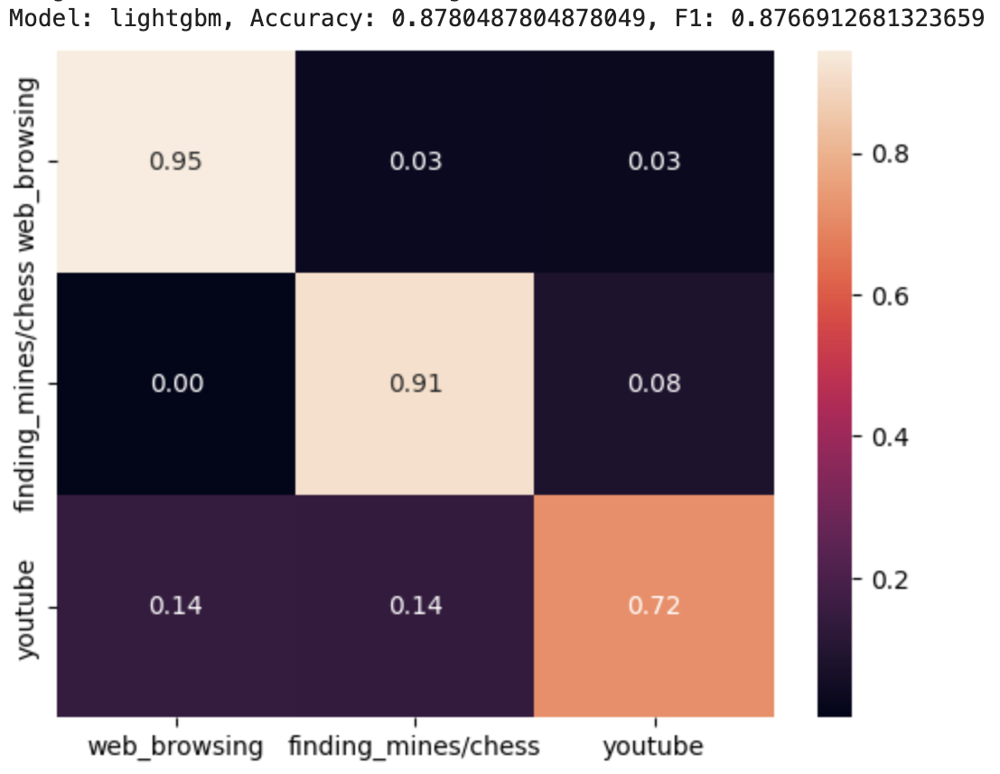
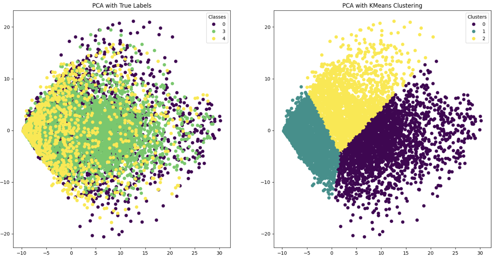
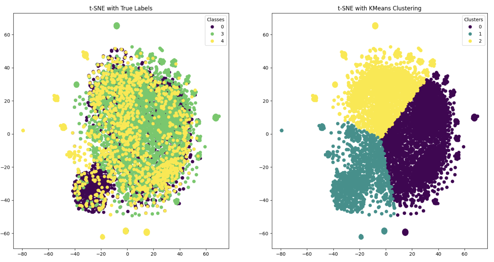

# Detecting User Actions from Mouse Events

## Introduction

This project aims to classify a user's current activity (e.g., web browsing, chatting, watching videos, reading) based solely on their mouse events. This approach enhances productivity by enabling features like sharing status updates on platforms like Slack or activating Focus mode, while preserving user privacy by avoiding more invasive monitoring methods such as screen captures or keystroke logging.

## Problem Statement

- **Problem:** Automatically identifying user activity purely based on mouse events, which avoids privacy concerns.
- **Motivation:** Enhancing user productivity and privacy by providing non-invasive activity recognition.

## Objectives

- Develop a model capable of distinguishing user activity with high accuracy.
- Preserve user privacy by using non-invasive data collection methods.

## Literature Review

Previous research has attempted to identify individuals based on their mouse usage patterns [3] or predict the next mouse event of the user [2]. However, we are approaching the problem by classifying the current user's high-level activity in real time. Kuric et al. [1] have suggested several features (such as clicks, velocity, acceleration, etc.) that can be used to classify current actions, which can support our project.

## Methodology

### Data Preprocessing Method Implemented

- **Feature Engineering:** Extracting additional insights like scroll patterns, click patterns, idle times, or mouse velocity.

**Mouse Movement-Inferred Feature Overview:**

- **Dimensionality Reduction (PCA and t-SNE):** 
PCA: Reduced high-dimensional data while retaining key features, minimizing overfitting and enhancing computational efficiency.
t-SNE: Used for 2D visualization to reveal data structure and cluster distribution, helping to better understand relationships between classes.
- **Windowing:** Divided the data into windows of varying sizes and intervals to capture both short-term and long-term patterns, enabling effective analysis of time-sequence data.
- **Oversampling:** Addressed class imbalance by duplicating minority class samples. RandomOverSampler was used to balance class distribution, allowing the model to learn each class more effectively.

### ML Algorithms/Models Implemented

In our project, we implemented both supervised and unsupervised learning methods for user behavior detection based on mouse movement data. For supervised learning, we trained the data using the LightGBM model, which has high prediction performance and efficient learning and inference due to the lightness of the model. The model performed with an Accuracy of 0.878 and an F1 score of 0.877. For unsupervised learning, we used K-Means clustering to identify hidden patterns and groups in the data. To do this, we used PCA and t-SNE as dimensionality reduction techniques to visualize the characteristics of the data and increase the performance of the clustering. 

1. **LightGBM:**
   - First, in the supervised learning approach, we employed the Gradient Boosting algorithm, which is a balanced model in terms of speed and performance. This model is particularly effective for handling large-scale and high-dimensional data due to its Leaf-wise Tree Growth splitting method.
2. **K-means:**
   - For the unsupervised learning approach, we applied K-means clustering after reducing dimensionality using PCA and t-SNE. The goal of using PCA and t-SNE was to reduce the complexity of the high-dimensional data and to mitigate potential overfitting in the model.

### Relevant Courses and Methods

- **CS 7641:** Unsupervised and Supervised Learning focusing on machine learning approaches for plain data.
- **CS 7643:** Deep learning models and algorithms, including time-series analysis.

## Results and Discussion

- **Visualizations:**
  - Supervised Learning Method: LightGBM
  

  - Unsupervised Learning Method: K-means
  
  

  In our project, we used a variety of visualizations to analyze the mouse movement data. We leveraged PCA and t-SNE to reduce the dimensionality so that we could visually interpret the high-dimensional data, and visualized the K-Means clustering results to more clearly see the boundaries of the clusters. The visualization of the actual labels versus the clustered results helped us understand if the model was detecting patterns in the data well. We also visualized the confusion matrix, which represents the performance of the LightGBM model, to check the prediction accuracy for each class.

- **Quantitative Metrics:**
  - LightGBM, used as a supervised learning model, achieved an Accuracy of 0.878 and an F1 score of 0.877, which shows that the model can predict different mouse movement patterns with high accuracy. By visually examining the prediction performance between each class through the confusion matrix, we were able to better understand the strengths and weaknesses of the model.
- **Analysis of LightGMB:**
  - The LightGBM model used in the project was chosen because it is lightweight, efficient, and has excellent characteristics in terms of learning speed and performance. In unsupervised learning, we applied K-Means clustering and used dimensionality reduction techniques PCA and t-SNE to clearly visualize and analyze the characteristics of the data to better identify potential clusters and behavioral patterns in the data. However, in the unsupervised Learning plot, neither PCA nor t-SNE could effectively separate the actual labels, indicating that these methods were not able to distinguish between classes without supervision.
- **Next Steps:**
  - The next step involves trying more different algorithms to improve the performance of the model. To do this, we plan to further utilize the HistGradientBoostingClassifier, RandomForestClassifier, Support Vector Classifier (SVC), LogisticRegression, Polynomial Regression (PolynomialFeatures + LogisticRegression), and K-nearest neighbors (KNeighborsClassifier) models. We will also increase the number of classifications and windows to increase the diversity of the data, so that the model can be trained using richer data to increase the generalization performance of the model and effectively detect more complex user behavior patterns. 

## Project Timeline

Below is the Gantt chart outlining each group member’s responsibilities for the project.

[Gantt Chart](https://docs.google.com/spreadsheets/d/14TtwuTkYRx8cqvmaVrm9Yi3lG_yQL1HBeeJYwnyOWzk/edit?usp=sharing)

## Team Contributions

Each group member's specific contributions to the project proposal are outlined in the table below.

| Name             | Proposal Contributions                                                                                                                 |
|------------------|----------------------------------------------------------------------------------------------------------------------------------------|
| **Ji Min Park**  | Set up evaluation metrics (accuracy, F1-score), visualizations, and analysis of model performance and feature importance.              |
| **Hyunju Ji**    | Implemented feature engineering, including velocity, acceleration, scroll patterns, and other mouse dynamics features.                 |
| **Woohyun Noh**  | Conducted literature review and contributed to data processing and feature engineering, focusing on feature extraction and integration.|
| **Jungwoo Park** | Implemented data preprocessing methods(Oversampling, PCA, t-SNE).                                                                      |
| **Minsuk Chang** | Developed and trained machine learning models (e.g., LightGBM, K-means), and experimented with different model configurations.         |

## References

1. E. Kuric, P. Demcak, M. Krajcovic, and P. Nemcek, “Is mouse dynamics information credible for user behavior research? An empirical investigation,” *Computer Standards & Interfaces*, vol. 90, p. 103849, 2024.
2. E. Y. Fu et al., “Your mouse reveals your next activity: towards predicting user intention from mouse interaction,” in *2017 IEEE 41st Annual Computer Software and Applications Conference (COMPSAC)*, vol. 1, pp. 869–874, 2017.
3. J. J. Matthiesen and U. Brefeld, “Assessing user behavior by mouse movements,” in *HCI International 2020-Posters*, pp. 68–75, 2020.

Implemented data preprocessing methods, including coordinate regularization, time slot formation, and dataset formation.
Conducted literature review and contributed to data processing and feature engineering, focusing on feature extraction and integration.

