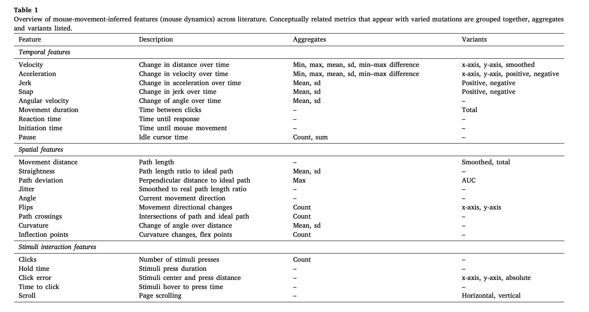
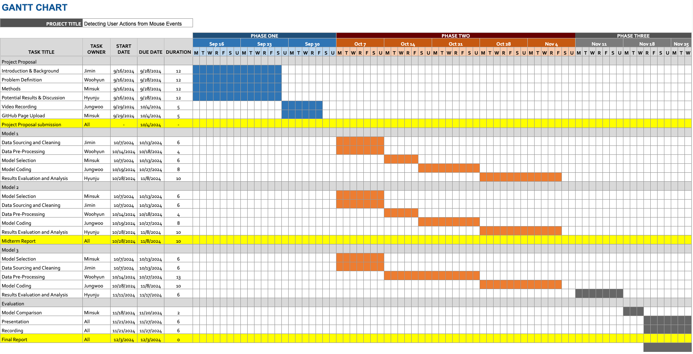

# Detecting User Actions from Mouse Events

## Introduction

This project aims to classify a user's current activity (e.g., web browsing, chatting, watching videos, reading) based solely on their mouse events. This approach enhances productivity by enabling features like sharing status updates on platforms like Slack or activating Focus mode, while preserving user privacy by avoiding more invasive monitoring methods such as screen captures or keystroke logging.

## Problem Statement

- **Problem:** Automatically identifying user activity purely based on mouse events, which avoids privacy concerns.
- **Motivation:** Enhancing user productivity and privacy by providing non-invasive activity recognition.

## Objectives

- Develop a model capable of distinguishing user activity with high accuracy.
- Preserve user privacy by using non-invasive data collection methods.

## Literature Review

Previous research has attempted to identify individuals based on their mouse usage patterns [3] or predict the next mouse event of the user [2]. However, we are approaching the problem by classifying the current user's high-level activity in real time. Kuric et al. [1] have suggested several features (such as clicks, velocity, acceleration, etc.) that can be used to classify current actions, which can support our project.

## Methodology

### Dataset Collection

We aim to collect 5 to 10 minutes of action recordings from 5 participants. The dataset will be split into frames and recorded every 0.1 seconds with corresponding mouse events. For better convergence and higher performance of our model, we will use MacBook Pro/Air for data collection, which has a uniform device (Trackpad) that records the mouse events.

### Data Preprocessing

- **Coordinate Regularization:** Adjusting the x, y coordinates based on individual screen sizes.
- **Time Slot Formation:** Segmenting continuous event streams into fixed timeslots (about 0.1 sec) for a more structured time series.
- **Feature Engineering:** Extracting additional insights like scroll patterns, click patterns, idle times, or mouse velocity.

### Data Preprocessing Method Implemented

**Mouse Movement-Inferred Feature Overview:**

Based on the above, we implemented a data preprocessing approach to extract various characteristics of mouse movement data. In the data preprocessing process, we extracted stimulus interaction characteristics, including temporal and spatial characteristics, from mouse movements for analysis, and calculated statistical characteristics (mean, standard deviation, etc.) of the data, including temporal characteristics (e.g., velocity, acceleration, movement duration), spatial characteristics (e.g., distance traveled, curvature, path intersection), and stimulus interaction characteristics (e.g., number of clicks, click duration). These preprocessing methods help interpret and analyze the data, and provide a basis for capturing detailed behavioral patterns of mouse movements. 

### Model Selection

1. **Time-Series Classification Models:**
   - Long Short-Term Memory (LSTM)
   - Temporal Convolutional Networks (TCNs)
2. **Window-Based Algorithms:**
   - Boosting or tree-based algorithms on time-series windows
3. **Unsupervised Approach:**
   - Clustering after embedding extraction with some time-series extraction model.
   - Clustering with pure mouse dynamics-based features.

### Relevant Courses and Methods

- **CS 7641:** Unsupervised and Supervised Learning focusing on machine learning approaches for plain data.
- **CS 7643:** Deep learning models and algorithms, including time-series analysis.

## Expected Results and Discussion

- **Quantitative Metrics:**
  - Accuracy, precision, recall, and F1-score for evaluating classification performance.
- **Project Goals:**
  - Ensure high privacy standards while maintaining accurate user activity detection.
- **Expected Outcomes:**
  - A model capable of distinguishing user activity with high accuracy while preserving privacy through non-invasive data collection methods.

## Project Timeline

Below is the Gantt chart outlining each group member’s responsibilities for the project.

[Gantt Chart](https://docs.google.com/spreadsheets/d/14TtwuTkYRx8cqvmaVrm9Yi3lG_yQL1HBeeJYwnyOWzk/edit?usp=sharing)

## Team Contributions

Each group member's specific contributions to the project proposal are outlined in the table below.

| Name             | Proposal Contributions                                                                                  |
|------------------|---------------------------------------------------------------------------------------------------------|
| **Ji Min Park**  | Dataset preparation, data preprocessing methods (e.g., sliding window technique)                        |
| **Hyunju Ji**    | Model selection (Boosting, LSTM, TCN), designing experiments, initial model training                    |
| **Woohyun Noh**  | Literature review on non-invasive user activity detection, documentation of results and discussions     |
| **Jungwoo Park** | Feature engineering (click patterns, scroll patterns, idle times), data augmentation                     |
| **Minsuk Chang** | Evaluation metrics (accuracy, precision, recall), writing report and final presentation                  |

## References

1. E. Kuric, P. Demcak, M. Krajcovic, and P. Nemcek, “Is mouse dynamics information credible for user behavior research? An empirical investigation,” *Computer Standards & Interfaces*, vol. 90, p. 103849, 2024.
2. E. Y. Fu et al., “Your mouse reveals your next activity: towards predicting user intention from mouse interaction,” in *2017 IEEE 41st Annual Computer Software and Applications Conference (COMPSAC)*, vol. 1, pp. 869–874, 2017.
3. J. J. Matthiesen and U. Brefeld, “Assessing user behavior by mouse movements,” in *HCI International 2020-Posters*, pp. 68–75, 2020.