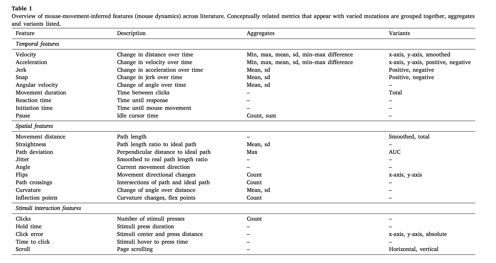
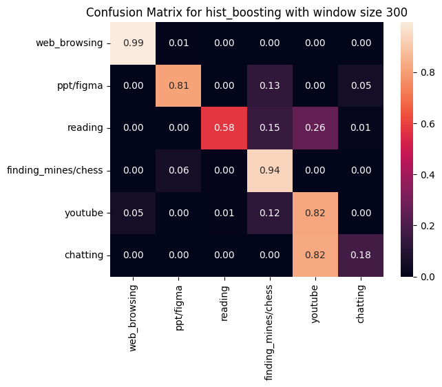
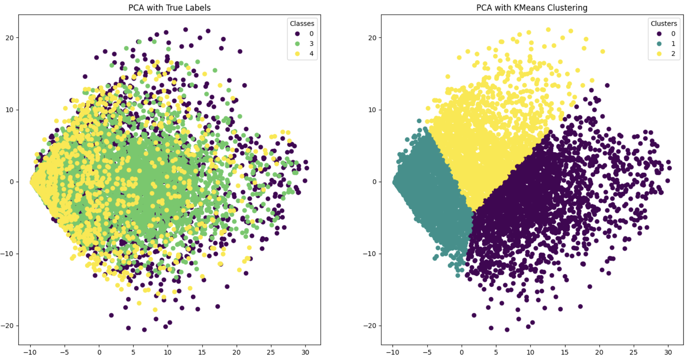
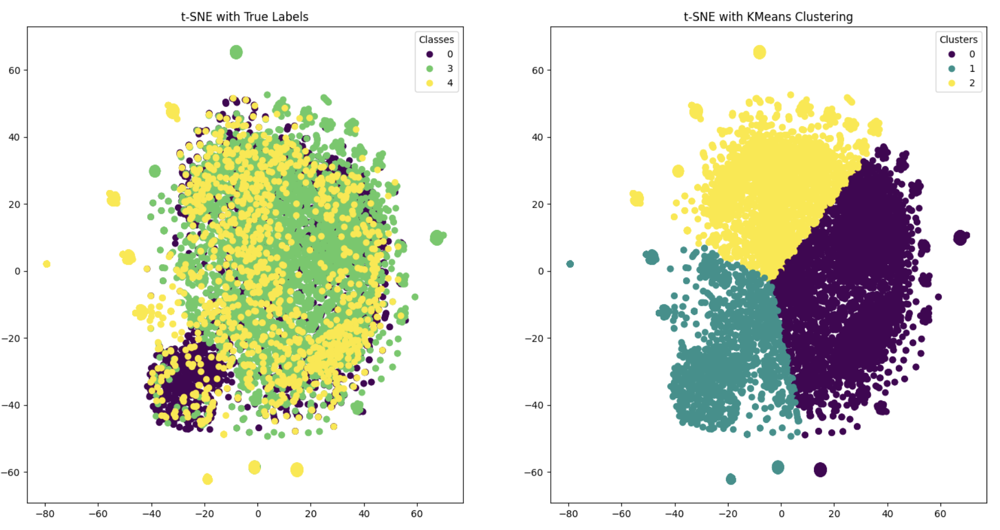
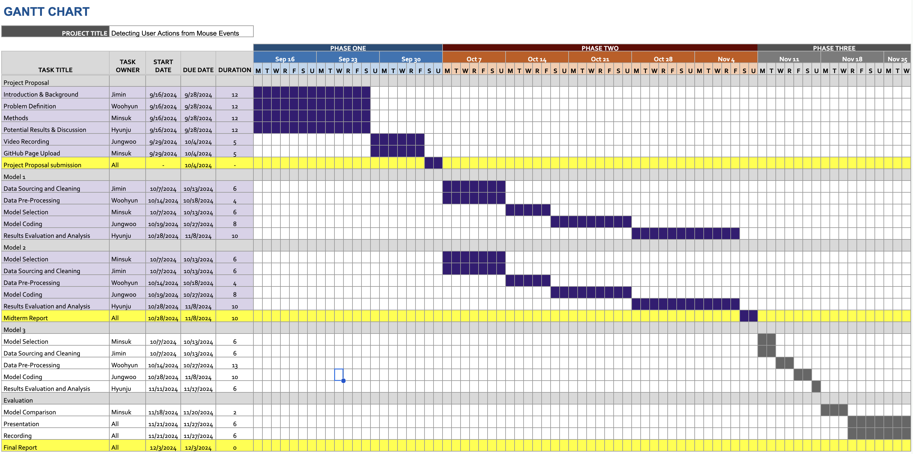

# Detecting User Actions from Mouse Events

## Introduction

This project aims to classify a user's current activity (e.g., web browsing, chatting, watching videos, reading) based solely on their mouse events. This approach enhances productivity by enabling features like sharing status updates on platforms like Slack or activating Focus mode, while preserving user privacy by avoiding more invasive monitoring methods such as screen captures or keystroke logging.

## Problem Statement

- **Problem:** Automatically identifying user activity purely based on mouse events, which avoids privacy concerns.
- **Motivation:** Enhancing user productivity and privacy by providing non-invasive activity recognition.

## Objectives

- Develop a model capable of distinguishing user activity with high accuracy.
- Preserve user privacy by using non-invasive data collection methods.

## Literature Review

Previous research has attempted to identify individuals based on their mouse usage patterns [3] or predict the next mouse event of the user [2]. However, we are approaching the problem by classifying the current user's high-level activity in real time. Kuric et al. [1] have suggested several features (such as clicks, velocity, acceleration, etc.) that can be used to classify current actions, which can support our project.

## Methodology

### Data collection
Data was collected from 5 team members who each performed mouse events for 10 minutes. Mouse events included chatting, playing chess, making ppt, reading, web browsing, and watching youtube videos. We extracted features for each time window from our recordings.txt and turned into csv file For each dataset, it had 2998 samples each representing interaction instance and 28 features capturing various characteristics of user actions. 

### Data Preprocessing Method Implemented

- **Feature Engineering:** Extracting additional insights like scroll patterns, click patterns, idle times, or mouse velocity.

**Mouse Movement-Inferred Feature Overview:**

- **Dimensionality Reduction (PCA and t-SNE):** 
PCA: Reduced high-dimensional data while retaining key features, minimizing overfitting and enhancing computational efficiency.
t-SNE: Used for 2D visualization to reveal data structure and cluster distribution, helping to better understand relationships between classes.
- **Windowing:** Divided the data into windows of varying sizes and intervals to capture both short-term and long-term patterns, enabling effective analysis of time-sequence data. We also measured the effect of changing the window sizes.
- **Oversampling:** Addressed class imbalance by duplicating minority class samples. RandomOverSampler was used to balance class distribution, allowing the model to learn each class more effectively.
- **Scaling** As each feature would have different distribution in their own space, we normalize each feature using the Standard scaler. We've used the code from the scikit-learn library.

### ML Algorithms/Models Implemented

#### Supervised Learning
In our project, we implemented both supervised and unsupervised learning methods for user behavior detection based on mouse movement data. We split the training and testing data into approximately 8:2 ratio as the dataset became larger. For supervised learning, we trained 3 ML models [LightGBM, Random Forest, KNN], and also the LSTM model in deep learning. We also changed the window size to watch the difference among the hyperparameters.
 

#### Unsupervised Learning
For unsupervised learning, we used K-Means clustering to identify hidden patterns and groups in the data. To do this, we used PCA and t-SNE as dimensionality reduction techniques to visualize the characteristics of the data and increase the performance of the clustering. 

1. **LightGBM:**
   - First, in the supervised learning approach, we employed the Gradient Boosting algorithm, which is a balanced model in terms of speed and performance. This model is particularly effective for handling large-scale and high-dimensional data due to its Leaf-wise Tree Growth splitting method.
2. **K-means:**
   - For the unsupervised learning approach, we applied K-means clustering after reducing dimensionality using PCA and t-SNE. The goal of using PCA and t-SNE was to reduce the complexity of the high-dimensional data and to mitigate potential overfitting in the model. Extracted raw features are used as the target data for the clustering.

### Relevant Courses and Methods

- **CS 7641:** Unsupervised and Supervised Learning focusing on machine learning approaches for plain data.
- **CS 7643:** Deep learning models and algorithms, including time-series analysis.

## Results and Discussion

- **Visualizations:**
  In our project, we used a variety of visualizations to analyze the mouse movement data. We leveraged PCA and t-SNE to reduce the dimensionality so that we could visually interpret the high-dimensional data, and visualized the K-Means clustering results to more clearly see the boundaries of the clusters. The visualization of the actual labels versus the clustered results helped us understand if the model was detecting patterns in the data well. We also visualized the confusion matrix, which represents the performance of the LightGBM model, to check the prediction accuracy for each class.  

  - Supervised Learning Method: LightGBM  
  

  - Unsupervised Learning Method: K-means  
  
  

  

- **Quantitative Metrics:**
  The following table shows the test accuracy for each model and window size. We derive insights from the table's results.

  | Models \ Window Size | 300 | 100 | 50 |
  |----------|----------|----------|----------|
  |   Gradient Boosting |  **0.85**  |   0.75  |   0.69  | 
  |   Random Forest     |   0.71  |   0.67  |   0.64  | 
  |   KNN               |   0.22  |   0.29  |   0.31  |
  |   LSTM              |   **0.85**  |   **0.77**  |   **0.75**  | 

  1. LSTM performs better than other ML models because of strong non-linearity which extracts complex patterns from the diverse mouse events.
  2. Gradient Boosting performs almost the same when the feature size is large (window size is large), indicating that large window size lets lighter ML models to learn complex patterns.
  3. Random forest performs slightly worse than boosting, indicating that boosting algorithms (regression trees) are better at finding out non-linear patterns than combination of pure trees. 
  4. Knn performs so bad that it's almost same as random guess. Strong non-linearity is required to solve this classification task.
- **Comparison between LSTM and Boosting:**
  - The LightGBM model used in the project was chosen because it is lightweight, efficient, and has excellent characteristics in terms of learning speed and performance. This was represented on the highest accuracy in 300-window. In terms of LSTM, it is also known to be lightweight but more effective on capturing the sequence information from the training data. This is represented as continuously high accuracy in 100 and 50-sized windows. Therefore, we can suggest applying different models based on the corresponding usages. For example, if fast inference is required and the window size should be small (shorter observing time), then LSTM with lower window size would be the best choice. However, only for the higher accuracy, I believe Gradient boosting model can perform well due to fast training and inference on the CPU.
- **Analysis of the Confusion Matrix**
  - As the confusion matrix shows, web browsing and game is the easiest task among the 5 categories. However, chatting and reading papers are showns as very difficult task. This is due to the motion overlap among the tasks. For example, the motion of reading can be included or be seen as web browsing, and chatting can be interpreted as youtube watching as it rarely includes mouse movement. Therefore, adding new features that can assist differentiating these actions would further enhance the model's classification performance.

## Project Timeline

Below is the Gantt chart outlining each group member’s responsibilities for the project.

[Gantt Chart](https://docs.google.com/spreadsheets/d/14TtwuTkYRx8cqvmaVrm9Yi3lG_yQL1HBeeJYwnyOWzk/edit?usp=sharing)

## Team Contributions

Each group member's specific contributions to the project proposal are outlined in the table below.

| Name             | Proposal Contributions                                                                                                                 |
|------------------|----------------------------------------------------------------------------------------------------------------------------------------|
| **Ji Min Park**  | Set up evaluation metrics (accuracy, F1-score), visualizations, and analysis of model performance and feature importance.              |
| **Hyunju Ji**    | Implemented feature engineering, including velocity, acceleration, scroll patterns, and other mouse dynamics features.                 |
| **Woohyun Noh**  | Conducted literature review and contributed to data processing and feature engineering, focusing on feature extraction and integration.|
| **Jungwoo Park** | Implemented data preprocessing methods(Oversampling, PCA, t-SNE).                                                                      |
| **Minsuk Chang** | Developed and trained machine learning models (e.g., LightGBM, K-means), and experimented with different model configurations.         |

## References

1. E. Kuric, P. Demcak, M. Krajcovic, and P. Nemcek, “Is mouse dynamics information credible for user behavior research? An empirical investigation,” *Computer Standards & Interfaces*, vol. 90, p. 103849, 2024.
2. E. Y. Fu et al., “Your mouse reveals your next activity: towards predicting user intention from mouse interaction,” in *2017 IEEE 41st Annual Computer Software and Applications Conference (COMPSAC)*, vol. 1, pp. 869–874, 2017.
3. J. J. Matthiesen and U. Brefeld, “Assessing user behavior by mouse movements,” in *HCI International 2020-Posters*, pp. 68–75, 2020.